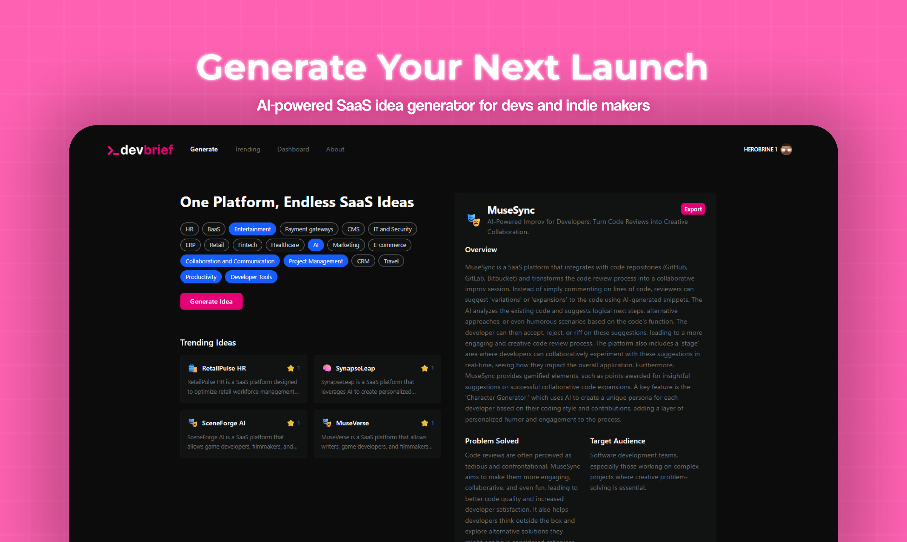
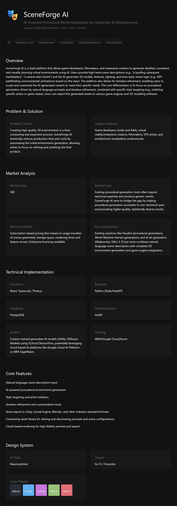

#  DevBrief.xyz — Curated AI-Powered SaaS Ideas for Developers

## 💡 What is DevBrief?

**DevBrief.xyz** is a curated, AI-powered idea generation platform designed **specifically for developers**, **students**, and **hackathon enthusiasts**.  
Instead of generating vague or random startup prompts, DevBrief provides **actionable SaaS product ideas** complete with detailed context, tech stack recommendations, MVP scope, and more — all in one click.

## 🌍 Live

👉 [https://devbrief.xyz](https://devbrief.xyz)

## Support by upvoting us 

## 🧠 Why DevBrief?

Inspiration is easy. Execution is hard — especially when all you have is a 5-word idea.

DevBrief bridges the gap between *“I want to build something”* and *“I know exactly what to build.”*

Each idea on DevBrief comes with:
- ✅ What problem it solves
- 🎯 Who it's built for
- 🔧 Core MVP features
- 💸 Revenue model suggestions
- 🌐 Suggested tech stack (Frontend, Backend, DB, Hosting, etc.)
- 🎨 UI design theme & color palette
- 🔍 Current market gap + size
- 🧵 Summarized TL;DR for quick scanning
- 🧠 Optional tags and emojis for visual clarity

## ✨ Key Features

- 🪄 **AI-Powered Idea Generation**  
  Just one click gives you a startup blueprint that’s practical and build-ready.

- 🔥 **Browse & Upvote Trending Ideas**  
  Discover what others are building, upvote the best, and get inspired.

- 🔐 **Private or Public Ideas**  
  Keep your ideas private or share with the world.

- 🌈 **UI Design Palettes Included**  
  Each idea suggests design themes and colors to kickstart prototyping.

- 🔜 **Coming Soon**  
  - 💬 Comments & Discussion
  - 📋 Full Startup Plan Generator
  - 🧩 Idea Remixing
  - 🎯 Save to Dashboard

## 👥 Who is it for?

DevBrief is built for:
- 👩‍💻 **Developers** looking for their next project
- 🎓 **Students** working on final year projects or side hustles
- 🏆 **Hackathon builders** who need fresh, scoped ideas

## 🛠️ Built With

- **Next.js** + **Vercel** for frontend & deployment  
- **Clerk** for authentication  
- **MongoDB** for idea storage  
- **TailwindCSS** for sleek UI  
- **OpenAI** for smart idea generation

## 📌 Example Output
Below is a real example generated using DevBrief, ready to be built:

## 🙌 Contribute, Collaborate or Share Feedback

Spotted a bug? Have an idea to improve DevBrief? Want to contribute?

📝 **Open an issue or pull request**, or  
💬 DM me directly — I’d love to connect.

## 🐱‍👤 Made by Developers, for Developers

If you're tired of "build the Uber of X" prompts and want **real ideas you can build right now**, DevBrief is your new favorite playground.

<!-- 📸 **[Add a Screenshot Here]**  
_You can update this section with screenshots of the homepage, idea cards, or dashboard preview._

--- -->

